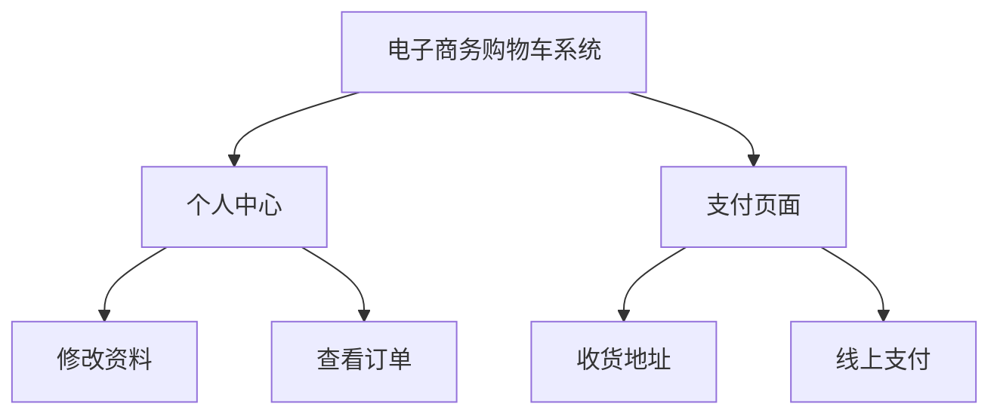
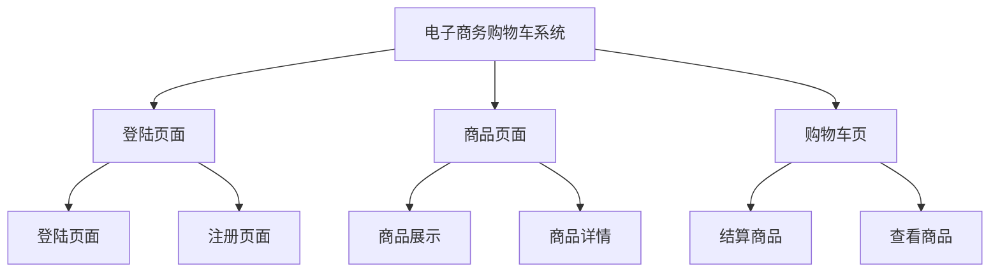

# 工作任务进度安排

<mark>数字代表优先级</mark>

## 要求/注意事项⚠️：

* 两周任务明细化：11月16-25号；

* 分任务<u>具体到人</u>；

* 每天<mark>19点</mark>统计每个人进度/<mark>完成度</mark>；

* 需求分析完善，要细化。

* 模块图。

* 流程图。

* 分析图（亮点模块，复杂模块，可以简单用图描述（精简），尽量用图。

## 整体需求：

* 完成登陆和注册的功能。

* 完成购物车与DB的交互以及相对应增删改查功能 。

* 完成支付页面功能 。

* 完成个人中心查看订单 以及 修改个人相关信息保存到数据库的功能 。

* 完成商品展示页面的筛选功能 。

* 完成单品页面的展示和交互功能 。

## 总体计划安排：

* 15号  需求分析。

* 16号  <u>完成登陆和注册</u>的功能。

* 17号  <u>完成商品展示页面</u>以及完成筛选功能。

* 18号  <u>完成单品页面</u>的展示和交互功能。

* 19号  完善商品页面功能修bug/<u>开始实现购物车功能</u>。

* 20号  <u>完成购物车</u>与DB的交互以及相对应增删改查功能。

第一星期结束总结：基本实现主要功能。

* 22号  完成<u>完善购物车</u>功能/开始着手支付功能。

* 23号  <u>完成支付</u>页面功能/测试。

* 24号  完成个人中心修改信息功能/测试。

* 25号 整体效果完成/完成所有功能/流畅展示所有功能/<mark>完善功能</mark>/<mark>整体测试</mark>。

项目完成总结：

* 26号  组内讨论/PPT制作/内部宣讲。

* 27号  PPT完善以及内部宣讲完成/休息。

* 29号 <mark>成果展示以及最终宣讲</mark>⚠️

## 结构分析：

# 流程图：

## 总流程图：

## 登陆页面流程图：

# 单日计划：

## 11.15 计划更新：

### 小组讨论：

* [x] 讨论/确定商品页面类型
- [x] 讨论/确定基础运行环境/版本环境

- [x] 搭建基本Servlet框架

- [x] 讨论/完善规定日期内的任务分配

- [x] 讨论/确定商品页面的需求分析

- [x] 讨论/确定数据库的基本需求

---

## 11.16 计划更新：

### 总计划：

     完成登陆和注册的功能。

### 每日任务具体到人：

* #### 张文正：

* [x] 编写java数据库底层文件，根据进度推进。
- [x] 实现基本注册功能，统一代码及页面风格。

- [x] 测试注册功能可行性发现bug，测试至少10个用户信息。

- [x] 完成后分析html代码，分析商品页面。
* #### 曾大龙：

* [x] 继续创建数据库以及相关的数据表 。
- [x] 实现登陆功能跳转商品页面。

- [x] 分析html代码，开始写商品页面的java类
* #### 蔡政：

* [x] 编写日后JavaWeb整体制作进度规划 。
- [x] 分配具体任务到个人。

- [x] 每天统计制作进度。

- [x] 页面分析以及技术分析（日常）。

- [x] 提前组员开始下一天任务。

### 第一天进度：

注册：100%

登陆：90%

总体：95%

总进度：15%

---

## 11.17计划更新：

### 总计划：

    <u>完成商品展示页面</u>以及完成筛选功能。

### 每日任务具体到人：

* #### 张文正：

* [x] 商品主页面list.html逻辑流程图绘制。
- [x] 实现对应功能。
* #### 曾大龙：

* [x] 商品详情页details.html逻辑流程图绘制。
- [x] 实现对应功能。
* #### 蔡政：

* [x] 编写日后JavaWeb整体制作进度规划 。

* [x] 分配具体任务到个人。

* [x] 每天统计制作进度。

* [x] 页面分析以及技术分析（日常）。

* [x] 提前组员开始下一天任务。

### 第二天进度：

：%

：%

：%

总进度：%

---

## 11.18计划更新：

### 总计划：

    完成单品页面的展示和交互功能。

### 每日任务具体到人：

* #### 张文正：

* [ ] 完善商品主页面index.html逻辑流程图绘制。

* [ ] 完成流程逻辑功能，保证交互顺畅。

* #### 曾大龙：

* [ ] 完善商品详情页list.html逻辑流程图绘制。

* [ ] 完成流程逻辑功能，保证交互顺畅。

* [ ] 测试通过，开始进入下一天任务。

* #### 蔡政：

* [ ] 完善商品主页面index.html逻辑流程图绘制。

* [ ] 测试完成流程逻辑功能，保证交互顺畅。

### 第三天进度：

：%

：%

：%

总进度：%

---

## 11.19计划更新：

### 总计划：

    完善商品页面功能修bug/<u>开始实现购物车功能</u>。

### 每日任务具体到人：

* #### 张文正：

* [ ] 绘制购物车页面cart.html逻辑功能流程图

* [ ] 完成大部分内容。

* #### 曾大龙：

* [ ] 分析数据库与购物车交互逻辑。

* [ ] 合作完成大部分内容。

* #### 蔡政：

* [ ] 写作完成购物车逻辑流程图，统一提交逻辑流程图。

* [ ] 进度统计/进度追赶。

### 第四天进度：

：%

：%

：%

：%

---

## 11.20计划更新：

### 总计划：

    完善商品页面功能修bug/<u>开始实现购物车功能</u>。

### 每日任务具体到人：

* #### 张文正：

* [ ] 维护注册页面/商品页面/购物车交互顺畅无逻辑错误。

* [ ] 完善/测试/维护本星期负责部分。

* #### 曾大龙：

* [ ] 维护登陆页面/商品详情页/购物车页交互/保证逻辑无错误。

* [ ] 完善/测试/维护本星期负责部分。

* #### 蔡政：

* [ ] 协作完成Login/Index/List代码/查缺补漏，逻辑交互进一步提要求。

### 第五天进度：

：%

：%

：%

：%

---

## 11.15~~11.20 第一星期进度汇总：

* 15号 需求分析。

* 16号 完善需求分析<u>完成登陆和注册</u>的功能。

* 17号 <u>完成商品展示页面</u>以及完成筛选功能。

* 18号 <u>完成单品页面</u>的展示和交互功能。

* 19号 完善商品页面功能修bug/<u>开始实现购物车功能</u>。

* 20号 <u>完成购物车</u>与DB的交互以及相对应增删改查功能。

实现：<mark>基本登陆注册/商品页面/购物车相关功能，无交互逻辑错误。</mark>

---

## 11.22计划更新：

### 总计划：

    完成<u>完善购物车</u>功能/开始着手支付功能。

### 每日任务具体到人：

* #### 张文正：

* [ ] 分析支付页面交互逻辑/绘制流程图。

* [ ] 编写/寻找支付模板，完成对应功能。

* #### 曾大龙：

* [ ] 分析个人中心交互逻辑/绘制流程图。

* [ ] 完成个人中心大部分逻辑交互。

* #### 蔡政：

* [ ] 实时更新进度/协助完成个人中心流程以及代码。

### 第六天进度：

：%

：%

：%

总进度：%

---

## 11.23计划更新：

### 总计划：

    完成支付页面功能/测试。

### 每日任务具体到人：

* #### 张文正：

* [ ] 测试支付页面代码。

* [ ] 完成后帮助完成个人中心。

* #### 曾大龙：

* [ ] 完成个人中心大部分代码。

* [ ] 尽量完成个人中心交互逻辑。

* #### 蔡政：

* [ ] 实时更新进度/协助完成个人中心流程以及代码。

### 第七天进度：

：%

：%

：%

总进度：%

---

## 11.24计划更新：

### 总计划：

    完成个人中心修改信息功能/测试。

### 每日任务具体到人：

* #### 张文正：

* [ ] 测试数据库功能，编写相关代码。

* #### 曾大龙：

* [ ] 

* [ ] 完成个人中心大部分代码。

* [ ] 尽量完成个人中心交互逻辑。

* #### 蔡政：

* [ ] 实时更新进度/协助完成个人中心流程以及代码。

### 第八天进度：

：%

：%

：%

总进度：%

---

## 11.25计划更新：

### 总计划：

    整体效果完成/完成所有功能/流畅展示所有功能/完善功能/整体测试。

### 每日任务具体到人：

* #### 张文正：

* [ ] 测试负责部分逻辑/不出bug。

* [ ] 维护

* #### 曾大龙：

* [ ] 测试负责部分逻辑/不出bug。

* [ ] 维护

* #### 蔡政：

* [ ] 协助维护

### 第九天进度：

：%

：%

：%

总进度：%

---

## 11.26计划更新：

### 总计划：

    组内讨论/PPT制作/内部宣讲。

### 每日任务具体到人：

* #### 张文正：

* [ ] 编写稿子，准备ppt素材

* [ ] 组内练习演讲。

* #### 曾大龙：

* [ ] 编写稿子，准备ppt素材

* [ ] 组内练习演讲。

* #### 蔡政：

* [ ] 编写稿子，准备ppt素材

* [ ] 组内练习演讲。

### 第十天进度：

---

## 11.27计划更新：

### 总计划：

    PPT完善以及内部宣讲完成/休息。

### 每日任务具体到人：

* #### 张文正：

* [ ] 组内练习演讲。

* #### 曾大龙：

* [ ] 组内练习演讲。

* #### 蔡政：

* [ ] 组内练习演讲。

### 第十一天进度：

：%

：%

：%

总进度：%

---

## 11.29计划更新：

### 总计划：

    成果展示以及最终宣讲⚠️